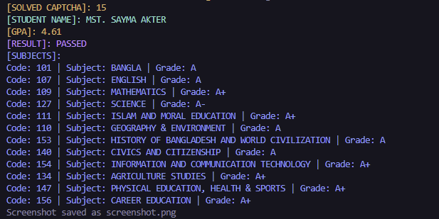

# EDUBOARDBD

**EDUBOARDBD** is an automation tool designed to scrape academic results from Bangladesh's education boards. It dynamically solves CAPTCHAs using Chrome DevTools Protocol (DP) and retrieves results based on user-provided criteria. Configurations are fetched dynamically from a server-side API to adapt to website updates, ensuring long-term reliability.




## Features

- 📂 **Multi-Board Support**: Works with SSC, HSC, JSC, and vocational certifications.
- 🤖 **Auto CAPTCHA Solving**: Uses Chrome DP to bypass CAPTCHA challenges dynamically.
- ⚙️ **Dynamic Configurations**: Automatically adapts to website changes via server-sided API.
- 🚀 **Fast & Efficient**: Streamlined process for quick result retrieval.
- 📆 **Wide Year Range**: Supports results from 1996 to 2025 (as of current).

## Prerequisites

- [Go](https://golang.org/) (v1.20+)
- [Chrome/Chromium](https://www.google.com/chrome/) (for CAPTCHA automation)

## Installation

1. **Clone the Repository**:
   ```bash
   git clone https://github.com/AKASH-UWU/EDUBOARDBD
   cd EDUBOARDBD
   ```

2. **Install Dependencies**:
   Ensure you have [Go](https://golang.org/) installed (v1.20 or later). Then, download the required dependencies:
   ```bash
   go mod download
   ```

3. **Set Up Chrome/Chromium**:
   - Install [Chrome](https://www.google.com/chrome/) or [Chromium](https://www.chromium.org/getting-involved/download-chromium/).
   - Ensure the browser is accessible in your system's PATH.

4. **Configure the Tool**:
   Update the configuration variables in `main.go` (lines 85-91) with your specific details:
   ```go
   var (
       exam  = ""       // Education level (e.g., "ssc", "hsc", "jsc") check Education Level Mappings section
       year  = ""      // Examination year (1996-2025)
       board = ""   // Board name (e.g., "dhaka", "chittagong") check Supported Boards section
       roll  = ""    // Student roll number
       reg   = "" // Registration number
   )
   ```

5. **Run the Tool**:
   - For quick testing:
     ```bash
     go run main.go
     ```
   - To build and run the executable:
     ```bash
     go build -o eduboardbd
     ./eduboardbd
     ```

## Usage

The tool will:
1. Fetch the latest configurations from the server API.
2. Launch Chrome in headless mode to solve CAPTCHAs.
3. Scrape and display results in the console.

### Example Output

Results are printed to the console in text format. Example:
```text
[SOLVED CAPTCHA]: 15
[STUDENT NAME]: MST. SAYMA AKTER
[GPA]: 4.61
[RESULT]: PASSED
[SUBJECTS]:
Code: 101 | Subject: BANGLA | Grade: A
Code: 107 | Subject: ENGLISH | Grade: A
Code: 109 | Subject: MATHEMATICS | Grade: A+
Code: 127 | Subject: SCIENCE | Grade: A-
Code: 111 | Subject: ISLAM AND MORAL EDUCATION | Grade: A+
Code: 110 | Subject: GEOGRAPHY & ENVIRONMENT | Grade: A
Code: 153 | Subject: HISTORY OF BANGLADESH AND WORLD CIVILIZATION | Grade: A
Code: 140 | Subject: CIVICS AND CITIZENSHIP | Grade: A
Code: 154 | Subject: INFORMATION AND COMMUNICATION TECHNOLOGY | Grade: A+
Code: 134 | Subject: AGRICULTURE STUDIES | Grade: A+
Code: 147 | Subject: PHYSICAL EDUCATION, HEALTH & SPORTS | Grade: A+
Code: 156 | Subject: CAREER EDUCATION | Grade: A+
```

## Supported Boards


| Board                              |     Code       |
|------------------------------------|----------------|
| Dhaka                              |  `"dhaka"`     |
| comilla                            | `"comilla"`    |
| Chittagong                         | `"chittagong"` |
| mymensingh                         | `"mymensingh"` |
| Rajshahi                           | `"rajshahi"`   |
| Barishal                           | `"barisal"`    |
| Sylhet                             | `"sylhet"`     |
| Dinajpur                           | `"dinajpur"`   |
| Jessore                            | `"jessore"`    |
| Madrasah (Dakhil)                  | `"madrasah"`   |
| Technical (Vocational)             | `"tec"`        |
| DIBS (Dhaka)                       | `"dibs"`       |


## Education Level Mappings

| Exam Type                          | Code         |
|------------------------------------|--------------|
| SSC/Dakhil/Equivalent              | `"ssc"`      |
| JSC/JDC                            | `"jsc"`      |
| SSC(Vocational)                    | `"ssc_voc"`  |
| HSC/Alim                           | `"hsc"`      |
| HSC(Vocational)                    | `"hsc_voc"`  |
| HSC(BM)                            | `"hsc_hbm"`  |
| Diploma in Commerce                | `"hsc_dic"`  |
| Diploma in Business Studies        | `"hsc"`      |

## License

This project is licensed under the **EDUBOARDBD RESULT SCRAPER EDUCATIONAL USE AND NON-MISUSE LICENSE (ERSEUANL)**.  
See [LICENSE](LICENSE) for details.

---

**Note**: Ensure Chrome is installed and accessible in your PATH for CAPTCHA automation. For issues or feature requests, please open an issue on the [GitHub repository](https://github.com/AKASH-UWU/EDUBOARDBD).